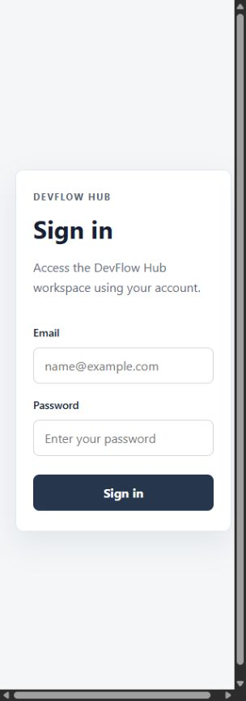
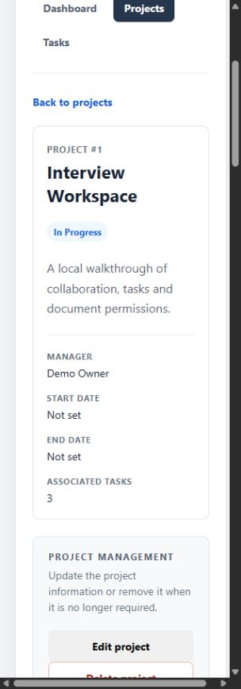
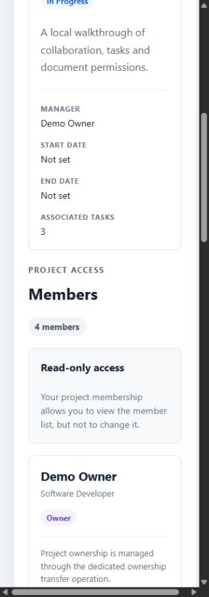

# DevFlow Hub

> Portuguese documentation: [`docs/README.pt.md`](docs/README.pt.md)

Full-stack project management platform built with **Java 21, Spring Boot, React, TypeScript and PostgreSQL**.

DevFlow Hub brings collaborators, projects, Agile tasks, role-based access and tracked work time into a single workspace.

## ✨ Highlights

- 🔐 JWT authentication and role-based project permissions
- 📁 Project and collaborator management
- ✅ Standalone and project-based task workflows
- ⏱️ Integrated task time tracking
- 👥 OWNER, MANAGER, CONTRIBUTOR and VIEWER project roles
- 🗄️ PostgreSQL persistence
- 🧪 Automated backend and frontend testing
- 🔄 Continuous Integration with GitHub Actions

**Stable academic submission:** `submission-2026-07-30`

> Active development continues through pull requests. Features that are not merged into `main` are documented separately and are not presented here as part of the stable release.

---

## Overview

DevFlow Hub was created to reduce the fragmentation that occurs when project information, task ownership and time records are spread across messages, documents, spreadsheets and separate tools.

The application currently provides:

- JWT-based authentication;
- an authenticated dashboard with live PostgreSQL data;
- project creation, editing and deletion;
- task creation, editing and deletion;
- standalone tasks and project tasks;
- task status, priority, assignment and project association;
- task timer start, pause, resume and completion workflows;
- project memberships with `OWNER`, `MANAGER`, `CONTRIBUTOR` and `VIEWER` roles;
- project ownership transfer;
- structured API errors for HTTP `400`, `401`, `403`, `404` and `409`;
- persistent PostgreSQL storage;
- resource-authorized document CRUD and attachment metadata foundations;
- a configurable local object-storage provider;
- automated backend and frontend validation.

Internal-program CRUD is available in the backend. The dedicated React management page remains planned.

## Architecture

```text
React + TypeScript + Vite
          |
          | HTTP, JSON and JWT Bearer
          v
Spring Boot REST API
          |
          +------------------+
          |                  |
          v                  v
     PostgreSQL       Local object storage
```

The React frontend is responsible for navigation, forms, authenticated client state and data presentation. The Spring Boot backend is responsible for authentication, resource authorization, business rules, validation, transactions and persistence.

The object-storage abstraction is implemented in the backend, but the current HTTP API exposes attachment metadata only. File upload, download and content deletion remain on the roadmap.

Architecture documentation:

- [`docs/architecture/frontend-decision.md`](docs/architecture/frontend-decision.md)
- [docs/architecture/project-access-control.md](docs/architecture/project-access-control.md)
- [docs/architecture/document-authorization.md](docs/architecture/document-authorization.md)
- [`docs/architecture/project-access-permission-matrix.md`](docs/architecture/project-access-permission-matrix.md)
- [`docs/architecture/project-access-endpoint-inventory.md`](docs/architecture/project-access-endpoint-inventory.md)

## Technology stack

### Backend

- Java 21
- Spring Boot 4.0.6
- Spring MVC
- Spring Security
- OAuth2 Resource Server
- Spring Data JPA
- Jakarta Validation
- Maven Wrapper

### Frontend

- React 19.2.8 (locked in `package-lock.json`)
- TypeScript 6.0.3 (locked in `package-lock.json`)
- Vite 8.1.5 (locked in `package-lock.json`)
- React Router 8.3.0
- Native Fetch API
- ESLint
- Vitest
- React Testing Library
- jsdom

### Data and infrastructure

- PostgreSQL
- H2 for automated tests
- Configurable local object storage
- GitHub Actions
- PowerShell PostgreSQL smoke tests

## Project structure

```text
DevFlow_Hub/
|-- .github/
|   `-- workflows/
|-- backend/
|   `-- src/
|-- database/
|   |-- migrations/
|   |-- devflow_hub.sql
|   |-- migrate_existing_database.sql
|   |-- INSTALACAO_BASE_DADOS_LOCAL.txt
|   `-- README.md
|-- docs/
|   `-- architecture/
|-- frontend/
|   |-- public/
|   `-- src/
|-- scripts/
|   `-- smoke-test-api.ps1
|-- LOG.md
`-- README.md
```

Generated directories such as `backend/target`, `frontend/node_modules` and `frontend/dist`, together with local configuration files such as `.env.local`, are intentionally excluded from Git.

## Quick start

### Prerequisites

- Java 21
- PostgreSQL
- Node.js `>=22.22.0`
- npm

For the reproducible interview setup, follow **[Local demo and walkthrough](docs/DEMO.md)**. The steps below describe a normal schema-only installation.

### 1. Create the database

Create a PostgreSQL database named:

```text
devflow_hub
```

Run the installation script from the repository root:

```powershell
psql -U postgres -d devflow_hub -v ON_ERROR_STOP=1 -f database/devflow_hub.sql
```

The same script can be opened and executed through pgAdmin Query Tool.

Database documentation:

- [`database/README.md`](database/README.md)
- [`database/INSTALACAO_BASE_DADOS_LOCAL.txt`](database/INSTALACAO_BASE_DADOS_LOCAL.txt)

### 2. Configure the backend

Example PowerShell configuration:

```powershell
$env:DB_URL = "jdbc:postgresql://localhost:5432/devflow_hub"
$env:DB_USERNAME = "postgres"
$env:DB_PASSWORD = "<local-postgresql-password>"
$env:SHOW_SQL = "false"
$env:JWT_SECRET = "<valid-base64-secret-containing-at-least-32-decoded-bytes>"
$env:JWT_ISSUER = "https://devflow-hub.local"
$env:JWT_EXPIRATION = "PT15M"
$env:OBJECT_STORAGE_PROVIDER = "local"
$env:OBJECT_STORAGE_LOCAL_ROOT_DIRECTORY = ".\data\object-storage"
$env:PORT = "8080"
```

`JWT_SECRET` must be valid Base64 and contain at least 32 bytes after decoding.

#### One-time initial administrator bootstrap

A professional environment should use a dedicated system administrator account rather than promoting a demonstration user or project owner. Before the first start, provide the account through process-level environment variables:

```powershell
$env:DEVFLOW_BOOTSTRAP_ADMIN_ENABLED = "true"
$env:DEVFLOW_BOOTSTRAP_ADMIN_NAME = "DevFlow Administrator"
$env:DEVFLOW_BOOTSTRAP_ADMIN_EMAIL = "admin@example.com"
$env:DEVFLOW_BOOTSTRAP_ADMIN_PASSWORD = "<unique-strong-password>"
```

The password must contain 12 to 64 characters, including uppercase, lowercase, numeric and special characters. The bootstrap refuses to run when an administrator already exists or when the email is already assigned. After the account is created, stop the application and remove the four bootstrap variables before starting it again. Do not commit administrator credentials or production secrets.

Start the backend:

```powershell
Set-Location ".\backend"
.\mvnw.cmd spring-boot:run
```

The API is available at:

```text
http://localhost:8080/api
```

### 3. Install and start the frontend

```powershell
Set-Location ".\frontend"
npm ci
npm run dev
```

The application is available by default at:

```text
http://localhost:5173
```

During local development, requests beginning with `/api` are proxied to `http://localhost:8080`.

For another backend origin, create `frontend/.env.local`:

```text
VITE_API_BASE_URL=https://api.example.com
```

Do not commit `.env.local`.

## Demonstration data and accounts

The normal installation script creates schema only, with no public accounts or automatic ADMIN. For local evaluation, use the guarded `database/demo_seed.sql` in a database named **devflow_demo** after installing the schema.

The seed creates OWNER, MANAGER, CONTRIBUTOR, VIEWER, outsider and system ADMIN accounts. All use the public password `DevFlowDemo-2026!`, marked **DEMO / LOCAL DEVELOPMENT ONLY**. Full commands, account emails, API checks and the interview walkthrough are in **[docs/DEMO.md](docs/DEMO.md)**. Existing installations are not reset; review any legacy demo accounts before deployment.

### Real application screenshots

Captured from the running local PostgreSQL demo. Additional dashboard/task captures and context are in the demo guide. Documents are currently API-only; no document UI screenshot is implied.

| Login | Project detail | VIEWER access |
|---|---|---|
|  |  |  |

## Authentication and session behaviour

The login endpoint is public:

```text
POST /api/auth/login
```

All other `/api/**` endpoints require a valid Bearer token, except where explicitly documented.

Protected requests must include:

```http
Authorization: Bearer <jwt-token>
```

The frontend stores the current session in `sessionStorage` and removes it when:

- the user signs out;
- the token expiry time is reached;
- an authenticated request returns HTTP `401`;
- the stored session is invalid.

The default JWT duration is `PT15M`. The current implementation uses absolute expiry and does not refresh the token based on user activity. A longer local value such as `PT1H` can be used for extended manual testing without changing the source code.

## Project access control

Project permissions are determined by active `project_memberships`, not by the professional value stored in `Collaborator.role`.

| Role | View project | Contribute | Manage project | Delete project | Manage memberships |
|---|---:|---:|---:|---:|---:|
| `OWNER` | Yes | Yes | Yes | Yes | Managers, Contributors and Viewers |
| `MANAGER` | Yes | Yes | Yes | No | Contributors and Viewers |
| `CONTRIBUTOR` | Yes | Yes | No | No | No |
| `VIEWER` | Yes | No | No | No | No |

Additional rules:

- only active memberships grant project access;
- project creation automatically assigns the creator as `OWNER` and initial manager;
- ownership transfer is explicit and transactional;
- generic membership endpoints cannot create, update or remove `OWNER`;
- removed memberships become `INACTIVE` and can be reactivated;
- optimistic-locking and duplicate conflicts return HTTP `409`;
- inaccessible resources are hidden with HTTP `404`;
- known resources with disallowed actions return HTTP `403`.

## System and document authorization

`USER` and `ADMIN` are system roles, separate from project membership and the descriptive professional `role`. ADMIN manages collaborator/internal-program writes; the database role is checked on each administrative operation. Generic collaborator JSON cannot change `systemRole`. ADMIN does not bypass project, task or document permissions.

Documents inherit their project or task visibility. Any active project member can read; OWNER/MANAGER/CONTRIBUTOR can create; OWNER/MANAGER can edit/delete. Standalone-task documents belong to the current task assignee. Updates authorize management of the original parent and contribution to the destination before mutation. Hidden/missing documents return 404; insufficient visible roles return 403; inactive document callers return 401. See the [full policy](docs/architecture/document-authorization.md).

## Task rules

- project tasks follow the user's active membership and role;
- standalone tasks are private to their assignee;
- project assignees must be eligible active project members;
- timer actions are restricted to the task assignee;
- moving a task validates the current project, destination project and assignee before saving;
- task status cannot be changed while its timer is active;
- completed tasks cannot restart the timer.

Task scheduling dates are not implemented yet. `createdAt` and `updatedAt` are audit fields, not `startDate` and `dueDate` planning fields.

## Main API areas

### Authentication

```text
POST /api/auth/login
PUT  /api/auth/change-password
```

### Collaborators

```text
GET    /api/collaborators
GET    /api/collaborators/{id}
POST   /api/collaborators
PUT    /api/collaborators/{id}
DELETE /api/collaborators/{id}
```

### Projects and memberships

```text
GET    /api/projects
GET    /api/projects/{id}
POST   /api/projects
PUT    /api/projects/{id}
DELETE /api/projects/{id}
GET    /api/projects/{projectId}/members
POST   /api/projects/{projectId}/members
PATCH  /api/projects/{projectId}/members/{collaboratorId}
DELETE /api/projects/{projectId}/members/{collaboratorId}
POST   /api/projects/{projectId}/ownership-transfer
```

### Tasks and timer

```text
GET    /api/tasks
GET    /api/tasks/{id}
POST   /api/tasks
PUT    /api/tasks/{id}
DELETE /api/tasks/{id}
POST   /api/tasks/{id}/start-timer
POST   /api/tasks/{id}/pause-timer
POST   /api/tasks/{id}/resume-timer
GET    /api/tasks/{id}/total-time
GET    /api/tasks/{id}/timer
POST   /api/tasks/{id}/complete
```

### Documents and attachment metadata

```text
GET    /api/documents/{id}
GET    /api/projects/{projectId}/documents
GET    /api/tasks/{taskId}/documents
POST   /api/documents
PUT    /api/documents/{id}
DELETE /api/documents/{id}
GET    /api/attachments/{id}
GET    /api/documents/{documentId}/attachments
```

### Internal programs and dashboard

```text
GET    /api/internal-programs
GET    /api/internal-programs/{id}
POST   /api/internal-programs
PUT    /api/internal-programs/{id}
DELETE /api/internal-programs/{id}
GET    /api/dashboard
```

## Testing and validation

### Backend

```powershell
Set-Location ".\backend"
.\mvnw.cmd clean verify
```

Phase 2 local validation (2026-09-20):

```text
Tests run: 283
Failures: 0
Errors: 0
Skipped: 0
BUILD SUCCESS
```

The backend suite covers services, controllers, JPA persistence, authentication, resource authorization, project memberships, ownership transfer, task movement, concurrency, object storage and domain rules.

### Frontend

```powershell
Set-Location ".\frontend"
npm run lint
npm test
npm run build
```

Phase 2 local validation (2026-09-20):

```text
Test Files: 12 passed
Tests: 53 passed
Lint: passed
Build: passed
```

### PostgreSQL smoke tests

With the backend running:

```powershell
powershell.exe `
  -NoProfile `
  -ExecutionPolicy Bypass `
  -File ".\scripts\smoke-test-api.ps1"
```

A successful run ends with:

```text
All PostgreSQL API smoke tests passed.
```

### GitHub Actions

The workflow is located at:

```text
.github/workflows/build-validation.yml
```

It validates PRs and pushes to both `main` and `develop` through Maven `clean verify`, npm, ESLint, Vitest and the production build. Both branches require reviewed PRs and successful **Backend** and **Frontend** checks. See [validation and integration notes](docs/phase2-validation.md).

## Current limitations

- no dedicated React page for internal-program management;
- attachment metadata endpoints still need resource authorization; document CRUD is protected;
- attachment content upload, download and deletion are not exposed through HTTP;
- tasks do not yet have planning `startDate` and `dueDate` fields;
- no refresh-token workflow or activity-aware session renewal;
- no warning before session expiry or unsaved-change protection;
- the interface is currently English-only;
- collaborator and internal-program dashboard totals are still global;
- no document React page; document operations are demonstrated through the API;
- five existing frontend dependency audit alerts (3 moderate, 2 high) remain to be triaged.

## Roadmap

- English and Portuguese internationalisation;
- task start dates, due dates and overdue indicators;
- secure refresh tokens and session-expiry warnings;
- dedicated internal-program React interface;
- project and task notes pages;
- complete attachment metadata authorization;
- secure attachment upload and download;
- import centre for Notion and Toggl Track data;
- duplicate detection, mapping, conflict resolution and import reports;
- filters, notifications and report export;
- functional identifiers such as `PRJ-0025` while preserving internal database IDs;
- deployment, monitoring, backup and production-security review.

## Repository strategy and releases

- `main`: stable submission branch;
- `develop`: integration branch;
- `feature/*`: new functionality;
- `fix/*`: corrections;
- `test/*`: tests;
- `docs/*`: documentation;
- `chore/*`: configuration and maintenance.

Release tags:

- `presentation-2026-07-30-final`: presentation snapshot;
- `submission-2026-07-30`: complete final academic submission.

## Author

Daniela Torres Almeida
